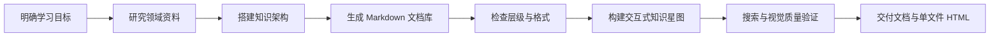

# 领域知识星图

把一个陌生领域，从零整理成一套可以阅读、检索和探索的学习系统：

- 结构化 Markdown 知识文档库
- 术语、方法、案例、规范与学习路线
- 可缩放、可搜索的交互式知识星图
- 跨文档关系与 Markdown 结构化展示
- 全量文档结构检查与可视化质量验证

它不是简单地生成一篇长文章，而是把知识组织成一套能够持续学习和使用的系统。

## 适用场景

你可以用它学习：

- 一个新职业：产品经理、数据分析师、UX 研究员
- 一个专业领域：心理学、摄影、品牌设计、投资基础
- 一套技术体系：React、AI Agent、数据库、网络安全
- 一个项目所需的完整知识：电商运营、内容增长、SaaS 销售
- 一个需要结合 AI 使用的领域：术语库、提示词模板、案例与评审标准

## 最终产出

一次完整运行通常会得到以下内容：

```text
学习目录/
├── 领域知识架构.md
├── 核心术语与心智模型.md
├── 工作流程与方法.md
├── 子领域与案例库.md
├── 工具、组件或规范手册.md
├── 分析与拆解方法.md
├── 参考库与分类词典.md
├── 质量评审与学习路线.md
└── 领域知识星图.html
```

实际文件会根据领域特点调整，不会机械套用固定目录。

## 工作流程



## 兼容性

本仓库遵循开放的 [Agent Skills 标准](https://agentskills.io/)，核心是包含 `SKILL.md`、脚本、参考资料和资源文件的完整文件夹。

目前可以原生使用 Agent Skills 的常见工具包括：

- [OpenAI Codex](https://developers.openai.com/codex/skills)
- [Claude Code](https://code.claude.com/docs/en/skills)
- [Cursor](https://cursor.com/docs/skills)
- [Windsurf / Cascade](https://docs.windsurf.com/windsurf/cascade/skills)
- [VS Code + GitHub Copilot Agent](https://agentskills.io/skill-creation/quickstart)
- [Gemini CLI](https://geminicli.com/docs/cli/skills/)
- 其他兼容 [Agent Skills](https://agentskills.io/clients) 的 Agent

不同软件扫描 Skill 的目录不同，请根据使用方式选择下面的安装方法。

## 安装方式

### 方式一：安装到项目中，推荐团队和跨工具使用

把 Skill 放在项目的 `.agents/skills/` 下，是目前兼容性较好的方式。Codex、Windsurf、Gemini CLI 和 VS Code Copilot Agent 均支持或兼容这个目录。

在你的项目根目录执行：

#### macOS / Linux

```bash
mkdir -p .agents/skills
git clone https://github.com/yj-ai-598/build-domain-learning-atlas.git \
  .agents/skills/build-domain-learning-atlas
```

#### Windows PowerShell

```powershell
New-Item -ItemType Directory -Force -Path ".agents\skills"
git clone https://github.com/yj-ai-598/build-domain-learning-atlas.git `
  ".agents\skills\build-domain-learning-atlas"
```

这种方式的优点：

- Skill 可以随项目一起提交到 Git。
- 团队成员克隆项目后即可使用。
- 同一份 Skill 可以被多个兼容工具发现。
- 不会影响其他无关项目。

### 方式二：安装为个人全局 Skill

全局安装后，可以在所有项目中使用。选择与你的软件对应的目录：

| 软件 | macOS / Linux 全局目录 | 项目目录 | 调用方式 |
|---|---|---|---|
| OpenAI Codex | `~/.agents/skills/` | `.agents/skills/` | `$build-domain-learning-atlas` |
| Claude Code | `~/.claude/skills/` | `.claude/skills/` | `/build-domain-learning-atlas` |
| Cursor | `~/.cursor/skills/` | `.cursor/skills/` | `/build-domain-learning-atlas` 或自动触发 |
| Windsurf / Cascade | `~/.codeium/windsurf/skills/` | `.windsurf/skills/` | `@build-domain-learning-atlas` |
| Gemini CLI | `~/.gemini/skills/` 或 `~/.agents/skills/` | `.gemini/skills/` 或 `.agents/skills/` | 自动触发或通过 Skills 管理 |
| VS Code + Copilot Agent | 建议使用项目目录 | `.agents/skills/` | Agent 模式中自动触发 |

#### Codex：个人全局安装

```bash
mkdir -p ~/.agents/skills
git clone https://github.com/yj-ai-598/build-domain-learning-atlas.git \
  ~/.agents/skills/build-domain-learning-atlas
```

重新打开 Codex；如果没有出现，可重启应用，在对话框输入 `$` 浏览可用 Skills。

部分旧版或特定桌面环境曾使用 `~/.codex/skills/`。如果你的现有 Skill 已经安装在那里并能正常使用，可以继续保留；新安装建议优先采用官方当前文档中的 `~/.agents/skills/`。

#### Claude Code：个人全局安装

```bash
mkdir -p ~/.claude/skills
git clone https://github.com/yj-ai-598/build-domain-learning-atlas.git \
  ~/.claude/skills/build-domain-learning-atlas
```

在 Claude Code 中输入：

```text
/build-domain-learning-atlas
```

也可以直接描述学习需求，让 Claude 根据 Skill 的 `description` 自动调用。

#### Cursor：个人全局安装

```bash
mkdir -p ~/.cursor/skills
git clone https://github.com/yj-ai-598/build-domain-learning-atlas.git \
  ~/.cursor/skills/build-domain-learning-atlas
```

重新加载 Cursor 窗口，然后在 Agent 对话中输入：

```text
/build-domain-learning-atlas
```

项目专用安装则把仓库放到：

```text
项目根目录/.cursor/skills/build-domain-learning-atlas
```

#### Windsurf / Cascade：个人全局安装

```bash
mkdir -p ~/.codeium/windsurf/skills
git clone https://github.com/yj-ai-598/build-domain-learning-atlas.git \
  ~/.codeium/windsurf/skills/build-domain-learning-atlas
```

也可以打开 Cascade 的 Customizations → Skills，通过界面创建或管理 Skill。

在对话中输入：

```text
@build-domain-learning-atlas
```

#### VS Code + GitHub Copilot Agent

在需要使用 Skill 的项目根目录执行：

```bash
mkdir -p .agents/skills
git clone https://github.com/yj-ai-598/build-domain-learning-atlas.git \
  .agents/skills/build-domain-learning-atlas
```

打开 Copilot Chat，切换到 **Agent 模式**，询问“当前有哪些可用 Skills？”检查是否被发现，然后直接描述学习任务。

#### Gemini CLI

Gemini CLI 可以直接从 GitHub 安装：

```bash
gemini skills install \
  https://github.com/yj-ai-598/build-domain-learning-atlas.git
```

也可以克隆到通用全局目录：

```bash
mkdir -p ~/.agents/skills
git clone https://github.com/yj-ai-598/build-domain-learning-atlas.git \
  ~/.agents/skills/build-domain-learning-atlas
```

检查安装结果：

```bash
gemini skills list --all
```

### Windows 全局安装示例

以通用目录为例：

```powershell
New-Item -ItemType Directory -Force -Path "$HOME\.agents\skills"
git clone https://github.com/yj-ai-598/build-domain-learning-atlas.git `
  "$HOME\.agents\skills\build-domain-learning-atlas"
```

如果使用 Claude Code，把目标目录替换为：

```text
$HOME\.claude\skills\build-domain-learning-atlas
```

如果使用 Cursor，把目标目录替换为：

```text
$HOME\.cursor\skills\build-domain-learning-atlas
```

### 没有安装 Git

1. 打开仓库主页。
2. 点击 **Code → Download ZIP**。
3. 解压文件。
4. 将文件夹重命名为 `build-domain-learning-atlas`。
5. 放入上表中对应的软件目录。
6. 确认文件结构不是多套了一层目录：

```text
build-domain-learning-atlas/
├── SKILL.md
├── scripts/
├── references/
└── assets/
```

`SKILL.md` 必须直接位于 Skill 文件夹的第一层。

### ChatGPT、Claude.ai、Gemini 网页版等纯聊天工具

纯网页聊天产品通常不会自动扫描本地 Skill 目录，可以使用手动方式：

1. 下载本仓库 ZIP。
2. 将 ZIP 或其中的 `SKILL.md`、`references/` 上传到对话或项目知识库。
3. 输入：

```text
请先阅读 SKILL.md，并按照其中的完整流程帮我系统学习【领域名称】。
需要生成 Markdown 文档库和交互式知识星图。
```

注意：

- 这种方式属于“把 Skill 当作上下文使用”，不是原生自动安装。
- 网页工具如果不能运行终端或写入本地文件，可能无法执行检查脚本、启动本地服务器或生成完整项目。
- 可以让网页工具先生成文档，再使用具备文件和终端能力的 Agent 构建 HTML 星图。

### 自建 Agent 或其他 AI 软件

如果你的 Agent 尚未原生支持 Agent Skills，可以采用以下任一种方式：

1. 在任务开始时把 `SKILL.md` 注入系统提示或任务上下文。
2. 让 Agent 读取仓库中的 `SKILL.md`，再按需读取 `references/`。
3. 按照 [Agent Skills 客户端接入指南](https://agentskills.io/client-implementation/adding-skills-support) 实现自动发现和按需加载。

Agent 需要具备文件读写、终端执行和浏览器验证能力，才能完成这个 Skill 的全部交付。

## 更新

使用 Git 安装的用户，在 Skill 目录执行：

```bash
git pull
```

例如通用全局安装：

```bash
cd ~/.agents/skills/build-domain-learning-atlas
git pull
```

如果软件没有自动发现更新，重新加载窗口、刷新 Skills 列表或重启软件。

## 卸载

删除对应的 Skill 文件夹即可。例如：

```bash
rm -rf ~/.agents/skills/build-domain-learning-atlas
```

Windows PowerShell：

```powershell
Remove-Item -Recurse -Force "$HOME\.agents\skills\build-domain-learning-atlas"
```

执行删除前请确认路径，避免误删其他文件。

## 使用方法

在 Codex 中直接说：

```text
使用 $build-domain-learning-atlas 帮我系统学习心理学，
面向零基础学习者，生成知识文档库和交互式知识星图。
```

也可以提供更具体的目标：

```text
使用 $build-domain-learning-atlas 帮我学习产品经理这个岗位。
我的目标是转岗和做 AI 产品，希望重点覆盖工作流程、常用术语、
需求文档、案例、提示词模板和面试准备。
```

```text
使用 $build-domain-learning-atlas 帮我学习摄影。
重点是人像摄影实战，需要器材基础、构图、用光、参数、
拍摄流程、案例拆解和作品自检清单。
```

## 知识星图能力

生成的交互式星图包含：

- 当前文档作为中心知识域
- H2 章节常驻导航
- H3/H4 主题与细节轨道
- 其他文档作为外围关联节点
- 缩放、拖拽、文件切换与层级筛选
- 节点详情与 Markdown 段落、列表、表格展示
- 全文档搜索、结果数量和搜索词高亮
- 标题命中、正文命中与跨文档跳转
- 响应式桌面和移动端布局

仓库中的 [UI 知识星图参考文件](assets/ui-knowledge-atlas-reference.html) 展示了这套交互模型。下载后可直接用浏览器打开。

## 文档检查脚本

Skill 内置 Markdown 语料检查工具：

```bash
python3 scripts/analyze_markdown_corpus.py /path/to/knowledge-directory
```

输出包括：

- 文件数、总行数和标题数
- H1-H4 层级分布
- 空父级章节
- 列表、表格和代码块数量
- 重复标题
- 缺失或重复 H1 的文件

保存为 JSON：

```bash
python3 scripts/analyze_markdown_corpus.py /path/to/knowledge-directory \
  --output corpus-audit.json
```

## 仓库结构

```text
build-domain-learning-atlas/
├── SKILL.md
├── agents/
│   └── openai.yaml
├── assets/
│   └── ui-knowledge-atlas-reference.html
├── references/
│   ├── atlas-interaction-spec.md
│   └── document-library-spec.md
└── scripts/
    └── analyze_markdown_corpus.py
```

## 设计原则

1. 先建立知识结构，再填充内容。
2. 区分稳定基础、当前实践和存在争议的观点。
3. 不把列表、表格和模板压成一整段文字。
4. 不只检查一个示例节点，要检查整个语料库。
5. 搜索结果必须能解释命中了什么以及为什么命中。
6. 知识图谱服务于理解，而不是只追求视觉效果。

## 自定义

核心流程在 [SKILL.md](SKILL.md)。

需要调整文档体系时，修改：

- [文档库规范](references/document-library-spec.md)

需要调整知识图谱视觉或交互时，修改：

- [星图交互规范](references/atlas-interaction-spec.md)

## 贡献

欢迎提交 Issue 或 Pull Request，尤其是：

- 新领域的知识架构案例
- 更可靠的 Markdown 解析规则
- 知识关系建模方法
- 搜索、可视化和移动端体验改进
- 不同学习目标下的文档模块模板
